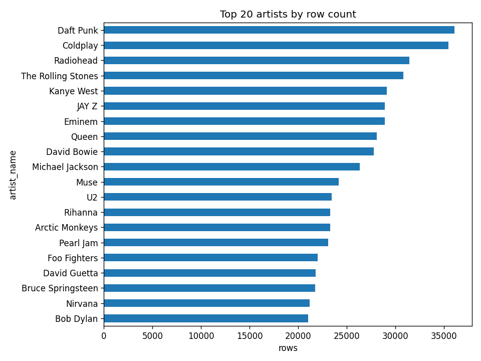
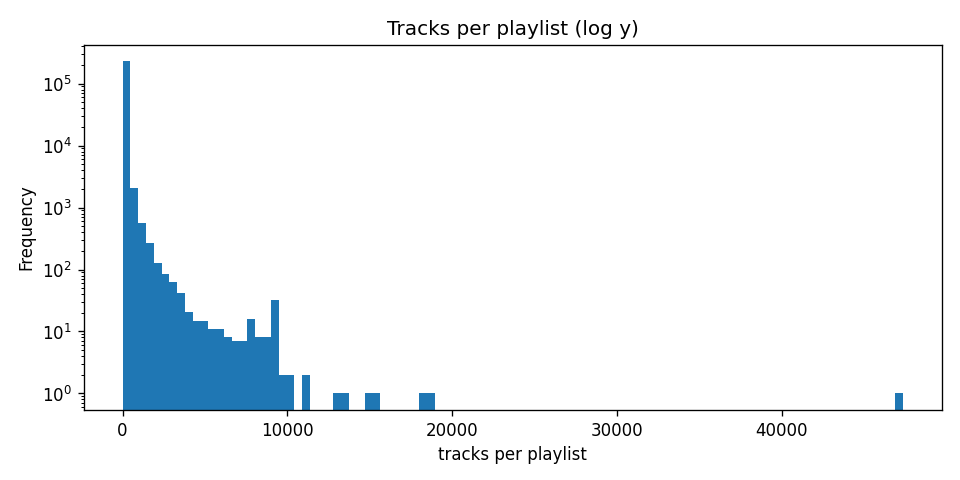
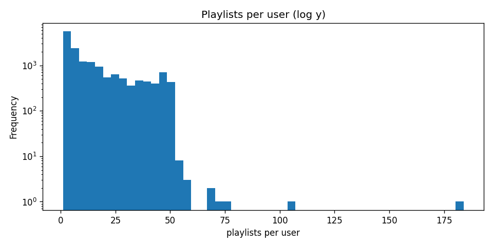

# Data Acquisition and Cleaning Report

## 1. Dataset

We use the [Spotify Playlists Dataset](https://www.kaggle.com/datasets/andrewmvd/spotify-playlists) hosted on Kaggle. The construction of the dataset, along with a description of its fields, is described in:

> Pichl, M., Zangerle, E., & Specht, G. (2015). *Towards a Context-Aware Music Recommendation Approach: What is Hidden in the Playlist Name?* IEEE International Conference on Data Mining Workshop. [IEEE Xplore](https://ieeexplore.ieee.org/document/7395827)

According to the paper, the dataset contains:

| Entity     | Count       |
|------------|-------------|
| Users      | 15,345      |
| Tracks     | 1,878,457   |
| Artists    | 276,848     |
| Playlists  | 143,528     |

Each row in the raw file represents a single (user, artist, track, playlist) tuple, indicating that a given user placed a given track (by a given artist) into a playlist with the given name. The four fields are `user_id`, `artistname`, `trackname`, and `playlistname`.

## 2. Downloading the Dataset

The dataset is fetched programmatically using the `kagglehub` Python package, which authenticates against Kaggle and caches the downloaded archive locally. Our [download_data.py](download_data.py) wraps this in a small CLI:

- The script is parameterized by a single argument, `--dest`, which controls the directory the CSV is copied into (default: `data/`).
- `kagglehub.dataset_download("andrewmvd/spotify-playlists")` returns a path to the cached dataset, from which we copy `spotify_dataset.csv` into the destination directory.
- A convenience target is exposed in the [Makefile](Makefile): running `make data` invokes the script with default arguments.

After downloading, the file `data/spotify_dataset.csv` is approximately 1.18 GB and contains 12,902,577 data rows (plus one header row).

## 3. Loading the Raw CSV

### 3.1 Why a Standard CSV Parser Fails

The raw file is not cleanly parseable by `pandas.read_csv` with default settings. Although every line in the file is well-formed at the *line* level — each value is wrapped in double quotes and separated by `","` — the values themselves contain unescaped inner double quotes. According to RFC 4180, an embedded `"` inside a quoted field must be escaped as `""`, but this dataset does not follow that convention.

When the C parser encounters one of these unescaped inner quotes, it loses track of field boundaries and reports a row with the wrong number of fields. With `on_bad_lines="skip"`, pandas silently drops 10,897 rows; with `on_bad_lines="warn"`, it emits roughly 10,000 warnings of the form `Skipping line N: expected 4 fields, saw 5`.

Concrete examples of offending raw lines (line numbers refer to [data/spotify_dataset.csv](data/spotify_dataset.csv)):

| Line     | Reason quotes break the parser                                                                                                | Snippet                                                                                                                  |
|----------|-------------------------------------------------------------------------------------------------------------------------------|--------------------------------------------------------------------------------------------------------------------------|
| 14735    | Track name itself begins with a quoted phrase: `"Kyllikki"`                                                                    | `..."Glenn Gould",""Kyllikki" - Three Lyric Pieces for Piano, Op. 41 - II. Andantino","Instrumenal - Home Listens"`      |
| 18825    | Stage name in artist field: `Charles "CJ" Hilton, Jr.`                                                                        | `..."Charles "CJ" Hilton, Jr./Raphael Saadiq/Stevie Wonder","Never Give You Up","Samedi matin"`                          |
| 23009    | Artist name itself contains quotes: `"Weird Al" Yankovic`, plus a quoted song title in the track field                        | `...""Weird Al" Yankovic","Cavity Search (Paody of "Hold Me, Thrill Me, Kiss Me, Kill Me" by U2)","NiN"`                 |
| 134461   | Quoted aria title inside the track name                                                                                       | `..."Giacomo Puccini","La Bohème / Act 1: "Questo Mar Rosso" - Live At Gasteig, München / 2007","rolando, renee flemming and others"` |
| 408805   | Quoted subtitle inside a classical track name (`"From the New World"`)                                                        | `..."Slovak Philharmonic","Dvorák: Symphony No. 9 in E Minor "From the New World", Op. 95, B. 178, Largo","Classical"`   |

The recurring pattern is: artist or track names that legitimately contain double-quote characters (stage names, quoted song titles, classical subtitles), embedded directly without RFC-4180 escaping.

### 3.2 The `load_lenient` Workaround

Because the file format is rigid at the line level — every line is exactly `"f1","f2","f3","f4"` — we bypass CSV escaping entirely and split on the literal three-character separator `","`. The function [`load_lenient` in data_cleaning.py](data_cleaning.py#L16-L35) does the following:

1. Skip the header line.
2. For each remaining line, strip the trailing newline.
3. Assert that the line begins and ends with a `"`, then strip those outer quotes.
4. Split on `","`. If the split yields exactly 4 parts, accept the row; otherwise record it as unrecoverable.

This recovers every row in the file. On the current download, the result is:

```
unrecoverable rows: 0
loaded: (12902577, 4)
```

That is 12,902,577 rows successfully parsed, versus the 12,891,680 produced by the default pandas parser — a difference of 10,897 rows recovered.

## 4. Data Cleaning Philosophy

Cleaning string-valued fields involves a tradeoff between two failure modes:

- **Under-normalization** leaves cosmetically different but semantically identical entries as distinct values (e.g., `"Daft Punk"` and `"Daft Punk "` are treated as two different artists), which inflates cardinality and fragments user/artist statistics.
- **Over-normalization** collapses cosmetically identical but semantically distinct entries into one (e.g., aggressively case-folding could merge two artists who happen to share a casefolded name but are, in fact, different acts).

We adopt a conservative stance: apply only those transformations that are guaranteed not to merge truly distinct entities. Whitespace stripping and internal-whitespace collapsing meet this bar; case-folding does not.

**An illustrative case where casefolding is risky.** A search of the loaded data shows 6,272 distinct casefolded artist strings that map to more than one display variant. Many of these are clearly the same artist with inconsistent capitalization (e.g., `"Kings Of Leon"` vs. `"Kings of Leon"`), but the mapping is not always safe. Consider:

| Casefolded key | Display variants in the data                                                                       |
|----------------|----------------------------------------------------------------------------------------------------|
| `muse`         | `Muse` (24,159 rows), `MUSE` (19 rows), `muse` (4 rows)                                            |
| `pitbull`      | `Pitbull` (11,199 rows), `PitBull`, `PITBULL`, `pitbull`, `PiTBULL` (1 row each)                   |

`Muse` is the British rock band, but `MUSE` could be a different stylized act (the American R&B vocalist who records as `MUSE` exists in real catalogs). Without external metadata to disambiguate, blindly merging these on `str.casefold()` would be a silent semantic error. We therefore refrain from any case-based canonicalization in this pass.

## 5. Cleaning Pipeline

The cleaning pipeline lives in [data_cleaning.py](data_cleaning.py). Each step is structured as a *diagnose* phase (which counts and prints examples of the issue) followed by a *fix* phase (which applies the transformation). Below is each step with the actual numbers and examples produced by running the script.

### 5.1 Drop Null Values

Diagnostic counts of `NaN`/`None` per column after loading:

| Column        | Null count |
|---------------|-----------:|
| `user_id`     | 0          |
| `artist_name` | 0          |
| `track_name`  | 0          |
| `pl_name`     | 0          |

No rows are dropped at this step. We keep the diagnostic in place because (a) it documents the assumption that the data has no nulls, and (b) it would surface immediately if a future re-download violated that assumption.

### 5.2 Strip Leading and Trailing Whitespace

Whitespace at the edges of a string never carries meaning in this dataset — a track named `"40 Winx"` is the same track as `"40 Winx\xa0"` (where `\xa0` is a non-breaking space). Stripping is therefore safe: any two values that were equal before stripping remain equal after stripping, so this transformation cannot merge two distinct entities.

Diagnostic counts:

| Column        | Rows with leading/trailing whitespace |
|---------------|--------------------------------------:|
| `user_id`     | 0                                     |
| `artist_name` | 1,533                                 |
| `track_name`  | 302                                   |
| `pl_name`     | 249,601                               |
| **Any field** | **251,315**                           |

Examples of values changed by stripping (output of the script):

| Column        | Before                  | After                |
|---------------|-------------------------|----------------------|
| `artist_name` | `'FAIRCHILD '`          | `'FAIRCHILD'`        |
| `artist_name` | `' Dolce'`              | `'Dolce'`            |
| `track_name`  | `'40 Winx\xa0'`         | `'40 Winx'`          |
| `track_name`  | `'\xa0Exit'`            | `'Exit'`             |
| `pl_name`     | `'Daft Punk '`          | `'Daft Punk'`        |

### 5.3 Drop Empty-String Fields

After stripping, we replace empty strings with `pd.NA` and drop any row whose `user_id`, `artist_name`, `track_name`, or `pl_name` is missing.

**Why this step must come *after* stripping.** Some fields contain only whitespace characters (for example, a single space `' '` or a single non-breaking space `'\xa0'`). These are semantically empty, but `s == ""` returns `False` for them. Counting empty-string fields *before* stripping would miss these, and they would survive into the cleaned data. Stripping first turns whitespace-only values into the empty string `""`, after which a single equality check against `""` catches both originally-empty and originally-whitespace-only fields.

Counts of whitespace-only fields that would have been missed without this ordering:

| Column        | Pre-strip empty | Whitespace-only (becomes empty after strip) |
|---------------|----------------:|--------------------------------------------:|
| `artist_name` | 33,562          | 205                                         |
| `track_name`  | 82              | 0                                           |
| `pl_name`     | 32              | 46                                          |

Concrete examples of whitespace-only entries that would have been silently retained as non-empty if the order were reversed:

- `artist_name = '\xa0'` (a single non-breaking space) → after strip → `''`
- `pl_name = ' '` (a single space) → after strip → `''`

Total dropped at this step: **33,870 rows**, leaving **12,868,707 rows**.

### 5.4 Collapse Internal Whitespace

A run of two or more whitespace characters inside a value is almost always a typo or an artifact of upstream concatenation (e.g., `"DJ Mitsu The Beats  &  DJ Kentaro"` versus `"DJ Mitsu The Beats & DJ Kentaro"`). Collapsing such runs to a single space normalizes these without any meaningful risk of merging distinct entities — it is highly implausible that two artists exist whose names differ only in the number of spaces between words.

Diagnostic counts:

| Column        | Rows with multiple-space runs |
|---------------|------------------------------:|
| `artist_name` | 506                           |
| `track_name`  | 3,652                         |
| `pl_name`     | 24,809                        |
| **Any field** | **28,899**                    |

Examples of values changed by this step:

| Column        | Before                                                            | After                                                          |
|---------------|-------------------------------------------------------------------|----------------------------------------------------------------|
| `artist_name` | `'DJ Mitsu The Beats  &  DJ Kentaro'`                             | `'DJ Mitsu The Beats & DJ Kentaro'`                            |
| `artist_name` | `'Alex Attias  presents Mustang'`                                 | `'Alex Attias presents Mustang'`                               |
| `track_name`  | `"It's Your World -  Part 1 & 2"`                                 | `"It's Your World - Part 1 & 2"`                               |
| `track_name`  | `'My Own Summer  (Shove It)'`                                     | `'My Own Summer (Shove It)'`                                   |
| `pl_name`     | `'Various Artists – Cyberdog Vol. 4 - Psy-Fi Systems  Mixed By Oforia'` | `'Various Artists – Cyberdog Vol. 4 - Psy-Fi Systems Mixed By Oforia'` |

### 5.5 Case Normalization — Deliberately Skipped

We do **not** build canonical case-insensitive keys. As discussed in §4, casefolding cannot be applied without risking the silent merger of distinct artists or tracks (e.g., `Muse` vs. `MUSE`). Because we have no external authority to disambiguate such pairs, the safest choice is to leave display-form casing intact and accept some duplicate-looking rows downstream.

### 5.6 Drop Exact Duplicate Rows

After the previous text-normalizing steps, we deduplicate on the full key `(user_id, artist_name, track_name, pl_name)`. A row that exactly matches another on all four fields contributes no new information and is safe to drop.

- Rows participating in exact duplicates: **754**
- Exact duplicate rows dropped: **377**
- Resulting shape: **(12,868,330 rows, 4 columns)**

Example of a duplicate group surfaced by the diagnostic:

| `user_id`                          | `artist_name`   | `track_name`                    | `pl_name`               |
|------------------------------------|-----------------|---------------------------------|-------------------------|
| `00123e0f544dee3ab006aa7f1e5725a7` | `David Grisman` | `Happy Birthday Bill Monroe`    | `ALL ROCK ARTIST LISTS` |
| `00123e0f544dee3ab006aa7f1e5725a7` | `David Grisman` | `Happy Birthday Bill Monroe`    | `ALL ROCK ARTIST LISTS` |
| `00123e0f544dee3ab006aa7f1e5725a7` | `David Grisman` | `Happy Birthday Bill Monroe`    | `David Grisman`         |
| `00123e0f544dee3ab006aa7f1e5725a7` | `David Grisman` | `Happy Birthday Bill Monroe`    | `David Grisman`         |

The first two rows form one duplicate pair (same user, same playlist, same track listed twice); rows 3–4 form another. Note that rows 1–2 and rows 3–4 are *not* duplicates of each other because the playlist names differ.

## 6. Cleaning Summary

| Stage                                 | Rows         | Δ vs. previous |
|---------------------------------------|-------------:|---------------:|
| Raw file (data rows)                  | 12,902,577   | —              |
| Loaded by `load_lenient`              | 12,902,577   | 0              |
| After dropping empty-string keys      | 12,868,707   | −33,870        |
| After dropping exact duplicates       | 12,868,330   | −377           |

The cleaned dataset is written to `data/spotify_dataset_clean.csv` with the schema `(user_id, artist_name, track_name, pl_name)` and zero null values in any column.

## 7. Exploratory Data Analysis

All numbers in this section were produced by [explore_data.py](explore_data.py), which loads `data/spotify_dataset_clean.csv` and prints diagnostics. Figures referenced below are saved to [figures/](figures/).

### 7.1 A note on identifiers

Three of the four columns are not unique on their own. The correct identifier for each entity is:

| Entity   | Identifier                   | Why a single column is insufficient                                                      |
|----------|------------------------------|------------------------------------------------------------------------------------------|
| User     | `user_id`                    | `user_id` is a hash and is unique by construction.                                       |
| Playlist | `(user_id, pl_name)`         | Different users routinely give playlists the same name (e.g., `Starred`, `Chill`).        |
| Track    | `(artist_name, track_name)`  | Many songs share a title across different artists (e.g., 1,591 distinct artists each have a track called `Intro`). |

Concrete cases that motivate the composite keys:

- **Same playlist name, different users.** The string `"Starred"` is used as a playlist name by **5,017 distinct users**, and `"Liked from Radio"` by **3,125 distinct users**. None of these are the same playlist.
- **Same track title, different artists.** The title `"Intro"` is attached to **1,591 distinct artists**; `"Home"` to 536; `"Outro"` to 449; `"Interlude"` to 421; `"Silent Night"` to 418. Treating these as a single track would conflate unrelated songs.

Because of this, the difference between *playlist names* and *playlists* (and between *track titles* and *tracks*) is not cosmetic — see §7.2.

### 7.2 Cardinalities

| Entity                                            | Count       |
|---------------------------------------------------|------------:|
| Unique users (`user_id`)                          | 15,914      |
| Unique artists (`artist_name`)                    | 289,713     |
| Unique track titles (`track_name` alone)          | 2,009,924   |
| **Unique tracks (`artist_name` + `track_name`)**  | **2,795,202** |
| Unique playlist names (`pl_name` alone)           | 155,989     |
| **Unique playlists (`user_id` + `pl_name`)**      | **231,569** |
| Total rows                                        | 12,868,330  |

Note that the user count (15,914) is somewhat larger than the 15,345 reported in the original paper, and the track and artist counts also differ — likely a consequence of how the Kaggle redistribution was prepared. The orders of magnitude are consistent.

The gap between *track titles* and *tracks* (2.0 M vs. 2.8 M) and between *playlist names* and *playlists* (156 K vs. 232 K) is the quantitative version of §7.1: roughly 39 % more distinct tracks emerge when we use the composite key, and roughly 48 % more distinct playlists.

### 7.3 Top artists and tracks

**Top 10 artists by row count** (each row = one inclusion of one of their tracks in some playlist):

| Rank | Artist             | Rows    |
|-----:|--------------------|--------:|
| 1    | Daft Punk          | 36,086  |
| 2    | Coldplay           | 35,485  |
| 3    | Radiohead          | 31,428  |
| 4    | The Rolling Stones | 30,832  |
| 5    | Kanye West         | 29,111  |
| 6    | JAY Z              | 28,928  |
| 7    | Eminem             | 28,896  |
| 8    | Queen              | 28,079  |
| 9    | David Bowie        | 27,802  |
| 10   | Michael Jackson    | 26,336  |

The full top-20 plot:



**Top 10 tracks** (using the `(artist, track)` composite key):

| Rank | Artist                  | Track                                    | Rows  |
|-----:|-------------------------|------------------------------------------|------:|
| 1    | M83                     | Midnight City                            | 2,609 |
| 2    | Daft Punk               | Get Lucky - Radio Edit                   | 2,341 |
| 3    | Imagine Dragons         | Radioactive                              | 2,336 |
| 4    | Of Monsters and Men     | Little Talks                             | 2,255 |
| 5    | Avicii                  | Wake Me Up                               | 2,242 |
| 6    | Lorde                   | Royals                                   | 2,219 |
| 7    | The Lumineers           | Ho Hey                                   | 2,180 |
| 8    | Macklemore & Ryan Lewis | Can't Hold Us - feat. Ray Dalton         | 2,066 |
| 9    | Bastille                | Pompeii                                  | 2,014 |
| 10   | Robin Thicke            | Blurred Lines                            | 1,997 |

These are dominated by 2011–2014 hits, which is consistent with the dataset's collection window described in the source paper.

### 7.4 Popular playlist names

Ranking playlist names by *number of distinct users* who use that name (rather than by raw row count) shows what kinds of playlists users tend to create:

| Rank | Playlist name           | Distinct users |
|-----:|-------------------------|---------------:|
| 1    | `Starred`               | 5,017          |
| 2    | `Liked from Radio`      | 3,125          |
| 3    | `Favoritas de la radio` | 745            |
| 4    | `My Shazam Tracks`      | 424            |
| 5    | `Christmas`             | 319            |
| 6    | `Rock`                  | 206            |
| 7    | `Country`               | 180            |
| 8    | `Chill`                 | 179            |
| 9    | `Classical`             | 165            |
| 10   | `Jazz`                  | 156            |

Two patterns stand out:
1. **Spotify-default and integration-default names dominate.** `Starred` was Spotify's default favourites bucket at the time of collection; `Liked from Radio`, `My Shazam Tracks`, and `Favoritas de la radio` are autogenerated by Spotify Radio and the Shazam integration. These are not user-curated in any meaningful sense and behave more like personal libraries than themed playlists.
2. **Beyond the defaults, generic mood/genre/activity names are common** (`Christmas`, `Rock`, `Chill`, `Workout`, `Running`). These suggest playlist names carry signal about intent, which aligns with the motivation of the source paper.

### 7.5 Playlist size

Distribution of *tracks per playlist*:

| Statistic | Value   |
|-----------|--------:|
| count     | 231,569 |
| mean      | 55.6    |
| std       | 271.4   |
| min       | 1       |
| 5 %       | 2       |
| 25 %      | 11      |
| **50 %**  | **16**  |
| 75 %      | 38      |
| 90 %      | 98      |
| 95 %      | 175     |
| 99 %      | 628     |
| max       | 47,363  |

Threshold counts:

| Bucket                           | Playlists | Share   |
|----------------------------------|----------:|--------:|
| Exactly 1 track                  | 10,067    | 4.3 %   |
| ≥ 10 tracks                      | 188,439   | 81.4 %  |
| ≥ 100 tracks                     | 22,581    | 9.8 %   |
| ≥ 1,000 tracks                   | 1,219     | 0.5 %   |

The distribution is heavily right-skewed: the median playlist holds 16 tracks, but the tail extends to a single playlist with 47,363 tracks (almost certainly a personal "everything I've saved" library rather than a curated playlist). For modeling, this matters — the very large playlists provide weak co-occurrence signal because they are not topically focused.



### 7.6 Per-user activity

**Playlists per user**:

| Statistic | Value  |
|-----------|-------:|
| mean      | 14.6   |
| 50 %      | 8      |
| 75 %      | 22     |
| 90 %      | 41     |
| 95 %      | 47     |
| 99 %      | 50     |
| max       | 184    |

**Rows (track placements) per user**:

| Statistic | Value     |
|-----------|----------:|
| mean      | 808.6     |
| 50 %      | 358       |
| 90 %      | 1,751     |
| 99 %      | 7,040     |
| max       | 295,291   |

Most users have well under twenty playlists, but a handful have more than a hundred. The 99th-percentile cap of 50 playlists per user at ~99 % suggests an internal product cap was in effect during collection.



### 7.7 Artist concentration within a playlist

A natural question for a recommendation model is whether playlists tend to be *artist-focused* (mostly tracks by one or two acts) or *thematic* (a wide spread of artists held together by genre, mood, or era). Two metrics:

**Distinct artists per playlist:**

| Statistic | Value |
|-----------|------:|
| 25 %      | 1     |
| 50 %      | 2     |
| 75 %      | 17    |
| 90 %      | 45    |
| 95 %      | 78    |
| max       | 16,995 |

**Top-artist share** (the largest count of any single artist within a playlist, divided by playlist size):

| Threshold                             | Playlists | Share  |
|---------------------------------------|----------:|-------:|
| Top artist ≥ 50 % of tracks           | 131,328   | 56.7 % |
| Top artist ≥ 80 % of tracks           | 117,568   | 50.8 % |
| **Top artist == 100 %** (single-artist) | **105,206** | **45.4 %** |

So roughly **45 % of all playlists contain only one artist**, and roughly **57 % are at least half dominated by a single artist**. This is a strong signal: a large fraction of the collection is what one might call "an album" or "an artist mix" rather than a thematic mix. For collaborative-filtering-style recommendation this is double-edged — single-artist playlists make intra-artist co-occurrence trivially strong (which is great for recommending by the same artist) but provide no cross-artist signal. The thematic minority (the right tail of the *distinct artists* distribution) is where cross-artist recommendation will have to come from.

This pattern is visible in the random sample of three playlists drawn by the script:

```
=== e9c742d5f9c9f29a6456d2d808c5c719 :: FJC ===
  thematic: 80s synthpop / new-wave mix across The Cure, New Order, Pet Shop Boys,
  Talking Heads, Depeche Mode, Tears For Fears, ... (15 distinct artists in 15 rows)

=== e13a4b6acbf7d7c5fe073f7866e50f02 :: The Killers – Direct Hits ===
  single-artist: every track is by The Killers (an album)

=== a68d38f2ebbfc7b41bdc1cd5e65abfd5 :: John Parish – Once Upon A Little Time ===
  single-artist: every track is by John Parish (an album)
```

### 7.8 Recommendation signal: track co-occurrence

The motivating question for the modelling phase is: **do playlists that share a track behave as if that track is informative about the rest of the playlist?** If yes, neighborhood-based methods (co-occurrence counts, item–item collaborative filtering, kNN) should work. To test this informally, for a small panel of seed tracks we collect the playlists each seed appears in, then count which other tracks appear most often in those same playlists.

If the signal is real, the top co-occurring tracks should be *recognizably related* — same artist, same scene, same era, same genre. They should not look like a random sample of popular songs.

#### Seed 1 — `Coldplay :: The Scientist` (in 1,347 playlists)

| Co-occurring track                  | Shared playlists |
|-------------------------------------|-----------------:|
| Coldplay :: Fix You                 | 659              |
| Coldplay :: Yellow                  | 630              |
| Coldplay :: Clocks                  | 617              |
| Coldplay :: Viva La Vida            | 491              |
| Coldplay :: In My Place             | 417              |
| Coldplay :: Trouble                 | 366              |
| Coldplay :: Paradise                | 334              |
| Coldplay :: Speed Of Sound          | 327              |
| Coldplay :: Green Eyes              | 298              |
| The Killers :: Mr. Brightside       | 290              |

**Reading.** Nine of the top ten co-occurring tracks are by Coldplay — exactly what you would expect if the signal is real. The tenth slot, *Mr. Brightside*, is a contemporaneous radio-rock anthem and is a plausible adjacency.

#### Seed 2 — `Daft Punk :: Get Lucky - Radio Edit` (in 2,341 playlists)

| Co-occurring track                                           | Shared playlists |
|--------------------------------------------------------------|-----------------:|
| Robin Thicke :: Blurred Lines                                | 655              |
| Macklemore & Ryan Lewis :: Can't Hold Us - feat. Ray Dalton  | 518              |
| Avicii :: Wake Me Up                                         | 517              |
| Lorde :: Royals                                              | 426              |
| Macklemore & Ryan Lewis :: Thrift Shop - feat. Wanz          | 423              |
| Bastille :: Pompeii                                          | 421              |
| Imagine Dragons :: Radioactive                               | 417              |
| OneRepublic :: Counting Stars                                | 380              |
| Bruno Mars :: Locked Out Of Heaven                           | 376              |
| M83 :: Midnight City                                         | 375              |

**Reading.** Every neighbor is a 2012–2014 chart hit. This is the "songs of summer 2013" cluster — the recovery here is by *era and chart position* rather than by artist. This is exactly the kind of cross-artist signal recommender systems are supposed to find.

#### Seed 3 — `Eminem :: Lose Yourself` (in 64 playlists)

| Co-occurring track            | Shared playlists |
|-------------------------------|-----------------:|
| Eminem :: Without Me          | 16               |
| Eminem :: The Way I Am        | 13               |
| 50 Cent :: I Get Money        | 12               |
| 50 Cent :: In Da Club         | 12               |
| Eminem :: My Name Is          | 11               |
| Eminem :: Stan                | 11               |
| Kanye West :: Stronger        | 11               |
| D12 :: Fight Music            | 11               |
| D12 :: My Band                | 11               |
| D12 :: Purple Pills           | 11               |

**Reading.** All ten neighbors are 2000s-era hip-hop, mostly by Eminem himself, his group D12, his Shady Records labelmate 50 Cent, and Kanye West. This is recovery by *genre and era*.

#### Seed 4 — `Bob Marley & The Wailers :: No Woman, No Cry` (in 4 playlists)

No neighbors with co-occurrence count ≥ 5.

**Reading.** This is a useful negative example. The seed is a famous song, but this particular `(artist, track)` string appears in only four playlists (most playlists list the artist as `Bob Marley` or some other casing/punctuation variant — which is precisely the case-folding tradeoff discussed in §4 of the cleaning report). For tracks with low support, no co-occurrence model can help. The long-tail problem is quantified next.

#### How thin is the long tail?

Distribution of *number of distinct playlists each track appears in*:

| Statistic | Value     |
|-----------|----------:|
| mean      | 4.6       |
| 50 %      | 1         |
| 90 %      | 7         |
| 95 %      | 14        |
| 99 %      | 57        |
| 99.9 %    | 277       |
| max       | 2,609     |

| Bucket                                  | Tracks      | Share   |
|-----------------------------------------|------------:|--------:|
| Tracks in only 1 playlist               | 1,577,228   | 56.4 %  |
| Tracks in ≥ 10 playlists                | 208,981     | 7.5 %   |
| Tracks in ≥ 100 playlists               | 13,202      | 0.5 %   |

**Implication for modelling.** Over half of all distinct tracks appear in exactly one playlist and are therefore invisible to any pure co-occurrence model. Recommendation will need to either (a) restrict the candidate pool to tracks above some minimum support, (b) lean on artist-level signal for cold tracks, or (c) bring in side information (e.g., audio features). On the bright side, the ~209 K tracks with support ≥ 10 constitute a sizeable head where co-occurrence works well, as the seed examples above demonstrate.

### 7.9 Takeaways

1. The cleaned dataset has 15,914 users, 231,569 playlists, 2,795,202 tracks, and 12,868,330 placements.
2. Identifiers must be composite: `(user_id, pl_name)` for playlists and `(artist_name, track_name)` for tracks. Using either column alone collapses semantically distinct entities (e.g., 1,591 distinct artists share the title `"Intro"`).
3. Playlists are heavy-tailed in size (median 16, max 47,363) and roughly half are dominated by a single artist.
4. Co-occurrence carries clear genre/era/artist signal in the head of the catalog (top neighbors of a Coldplay, Daft Punk, or Eminem seed are themselves recognizably Coldplay-, 2013-pop-, or hip-hop-related). However, 56 % of tracks appear in only one playlist, so the long tail will need separate treatment in any recommendation model.

## 8. Data Processing (Train/Test Split)

This section describes the preparation of the cleaned dataset for the recommendation experiment. The script is [data_processing.py](data_processing.py); its outputs land in [data/spotify/](data/spotify/) so that they can be consumed directly by [recommendation_final.py](recommendation_final.py).

### 8.1 Configuration

| Constant              | Value | Purpose                                                                                  |
|-----------------------|------:|------------------------------------------------------------------------------------------|
| `MIN_SONG_FREQ`       | 3     | Minimum number of (artist, track) occurrences across the whole dataset to keep the song.|
| `MIN_PLAYLIST_SIZE`   | 6     | Minimum playlist size for a playlist to be eligible to enter the test set.               |
| `TEST_PLAYLIST_FRAC`  | 0.20  | Fraction of all playlists that are sampled into the test set.                            |
| `HIDDEN_SONG_FRAC`    | 0.20  | Within each test playlist, fraction of tracks held out as the prediction target.         |
| `RANDOM_SEED`         | 42    | Seed for the test sampling and per-playlist hiding.                                      |

### 8.2 Load and Re-validate the Cleaned Dataset

The cleaned CSV is loaded with `keep_default_na=False` so that literal strings such as `"None"`, `"N/A"`, and `"null"` (which appear as real artist, track, or playlist names) are preserved as strings rather than silently coerced to `NaN`. The script then asserts:

- the loaded shape matches the cleaning step output (`(12,868,330, 4)`),
- there are zero null values in any column,
- there are zero empty-string entries in any column.

If any of these assertions fail, the cleaning step has either been skipped or produced an unexpected output, and the script aborts so the issue can be fixed at its source rather than papered over here.

### 8.3 Filtering Low-Frequency Songs

Songs that appear fewer than three times across the entire dataset are dropped. Two reasons motivate this:

1. **Suspicious provenance.** A `(artist_name, track_name)` pair that appears exactly once is much more likely to reflect a typo, an unusual punctuation variant, or a parsing artifact than a genuine catalog item. The cleaning step in §5 cannot detect such cases without risking false merges (see §4 on case-folding), so the filter is applied here at the modelling boundary instead.
2. **No usable co-occurrence signal.** A song that appears only once or twice cannot meaningfully participate in a co-occurrence model: with one occurrence there is nothing to "co-occur" with at evaluation time, and with two occurrences any signal is likely overfit.

**Distribution of song frequencies before filtering:**

| Statistic | Value     |
|-----------|----------:|
| count     | 2,795,202 |
| mean      | 4.6       |
| 50 %      | 1         |
| 90 %      | 7         |
| 99 %      | 57        |
| max       | 2,609     |

| Bucket                          | Songs       | Share   |
|---------------------------------|------------:|--------:|
| Appearing exactly once          | 1,577,228   | 56.4 %  |
| Appearing < 3 times (dropped)   | 2,033,394   | 72.7 %  |
| Appearing ≥ 3 times (kept)      | 761,808     | 27.3 %  |

**Examples of songs dropped at this step.** Many of the singletons look like artist back-catalog items not present in any other user's collection, but a substantial fraction look like minor punctuation/formatting variants of more popular songs. For instance, the script prints these singletons by `Near The Parenthesis`:

| `artist_name`        | `track_name`              | freq |
|----------------------|---------------------------|-----:|
| Near The Parenthesis | Into The Green            | 1    |
| Near The Parenthesis | colors live remarkable    | 1    |
| Near The Parenthesis | cerda`s plan              | 1    |
| Near The Parenthesis | a little damaged          | 1    |
| Near The Parenthesis | a brief walk in the sea   | 1    |

The bottom four titles are all-lowercase and use a backtick instead of an apostrophe in `cerda\`s plan` — strong indicators of an upstream import that did not go through the same naming pipeline as the rest of the catalog.

**Effect of the filter:**

| Quantity                         | Before        | After         | Δ              |
|----------------------------------|--------------:|--------------:|---------------:|
| Distinct songs (artist + track)  | 2,795,202     | 761,808       | −2,033,394     |
| Rows                             | 12,868,330    | 10,378,770    | −2,489,560     |

About 19 % of the rows are dropped along with about 73 % of the unique songs.

### 8.4 Train / Test Split

#### Test eligibility

After song filtering, some playlists have shrunk in size. We require that any playlist promoted to the test set still hold at least six tracks before any masking. The arithmetic justifying the threshold is:

- With `HIDDEN_SONG_FRAC = 0.20`, a 6-track playlist hides `round(6 × 0.20) = 1` track and leaves 5 tracks visible.
- A test playlist therefore needs at least 1 track to *evaluate against* and at least 5 tracks to *seed predictions from*.
- Any smaller playlist would either yield zero hidden tracks (after rounding) or zero seen tracks, making evaluation meaningless.

Counts after the song filter:

| Eligibility                              | Playlists |
|------------------------------------------|----------:|
| Eligible for test (≥ 6 tracks)           | 183,741   |
| Forced into train (< 6 tracks)           | 35,548    |
| **Total**                                | **219,289** |

#### Sampling

We sample `round(0.20 × 219,289) = 43,858` distinct playlists uniformly at random *from the eligible pool* and assign them to the test set. Everything not in the test set — including all 35,548 sub-threshold playlists — goes to train.

| Set     | Playlists  | Rows         | Min size | Median | Max     |
|---------|-----------:|-------------:|---------:|-------:|--------:|
| Train   | 175,431    | 7,971,948    | 1        | 14     | 30,364  |
| Test    | 43,858     | 2,406,822    | 6        | 18     | 8,812   |

#### Why we do *not* enforce a minimum size on training playlists

The bullet "even though the trainset contains too less tracks (for example, 1 track) it would not hurt the model's performance" is true for the kNN- and BM25-style item-collaborative models implemented in [recommendation_final.py](recommendation_final.py). The reasoning:

- A train playlist contributes one row to the (playlist × song) sparse matrix `sp_A`. A 1-track row contains a single non-zero entry.
- At inference time, similarity between a test seed and that train row is `dot(seed, train_row)`, which is non-zero only when the test seed already contains the same single song. In that case the train row is a legitimate (if weak) neighbor; in all other cases it contributes exactly zero.
- Crucially, a 1-track train row cannot create *false* co-occurrence — a song needs at least two playlist co-locations to drive a song–song similarity, and a 1-track row supplies none.
- The cost of keeping these tiny rows is one extra non-zero per row in the sparse matrix; storage and compute are negligible.

In other words: small train playlists carry little information, but they carry no misinformation either, and removing them would discard a small amount of long-tail signal for no measurable gain.

### 8.5 Hiding 20 % of Each Test Playlist

For each of the 43,858 test playlists, we sample `max(1, round(0.20 × |playlist|))` tracks uniformly at random as the held-out set; the remainder becomes the seed visible to the model.

| Quantity                              | Value      |
|---------------------------------------|-----------:|
| Total seen rows (input to the model)  | 1,926,108  |
| Total hidden rows (evaluation target) | 480,714    |
| Hidden tracks per test playlist       | min 1, median 4, max 1,762 |
| Seen tracks per test playlist         | min 5, median 14, max 7,050 |

The post-conditions `min(hidden_per_playlist) ≥ 1` and `min(seen_per_playlist) ≥ 1` are asserted in the script so that a future configuration change (for example, lowering `MIN_PLAYLIST_SIZE`) cannot silently produce empty splits.

**Concrete example.** Test playlist `pl_id=42103` is named `'Relax, Dave'` (a chillwave/indie-folk mix). After hiding, the split looks like:

| Side    | Sample of tracks                                                                                                           | Count |
|---------|----------------------------------------------------------------------------------------------------------------------------|------:|
| Seen    | Bon Iver — *Skinny Love*, Mac Demarco — *Chamber Of Reflection*, Tycho — *Montana*, Pink Floyd — *Us And Them*, Beck — *Waking Light*, Washed Out — *Feel It All Around*, ... | 47    |
| Hidden  | Beck — *Blue Moon*, Beck — *Morning*, Father John Misty — *Nancy From Now On*, Bon Iver — *Perth*, Phantogram — *Bill Murray*, ... | 12    |

The hidden tracks share artists, era, and mood with the seen tracks (Beck appears on both sides, as do other indie-folk acts), which is what makes this playlist a fair evaluation case for a co-occurrence-based recommender.

### 8.6 Identifier Assignment and Output Files

The CSVs written by this stage use compact integer identifiers rather than the original `(user_id, pl_name)` and `(artist_name, track_name)` strings. There are two reasons:

1. **Memory.** [recommendation_final.py](recommendation_final.py) materializes a sparse `(n_playlists × n_songs)` matrix. Integer keys map directly to row/column indices and avoid carrying multi-megabyte string columns through downstream pandas/scipy operations.
2. **Stability.** A single source of truth for ids — `song_meta_no_duplicates.csv` and `playlist_meta_*.csv` — guarantees that the same playlist or song has the same id in every artifact, even after re-runs of the modelling code. The metadata files preserve the human-readable names so that any predicted `song_id` can be translated back.

`pl_id` is assigned per `(user_id, pl_name)` and `song_id` per `(artist_name, track_name)`, both as small (`int32`) integers in `[0, n)`.

**Output files** (all in [data/spotify/](data/spotify/)):

| File                              | Schema                            | Rows       | Consumed by                                          |
|-----------------------------------|-----------------------------------|-----------:|------------------------------------------------------|
| `playlists_train.csv`             | `pl_id, song_id`                  | 7,971,948  | `recommendation_final.py` — corpus of train playlists |
| `playlists_test_seen.csv`         | `pl_id, song_id`                  | 1,926,108  | `recommendation_final.py` — visible seed for each test playlist |
| `playlists_test_hidden.csv`       | `pl_id, song_id`                  |   480,714  | `recommendation_final.py` — evaluation target         |
| `song_meta_no_duplicates.csv`     | `song_id, artist_name, track_name`|   761,808  | `recommendation_final.py` — canonical song universe   |
| `playlist_meta_train.csv`         | `pl_id, user_id, pl_name, num_artists, num_tracks` | 175,431 | Lookup / inspection                                   |
| `playlist_meta_test.csv`          | `pl_id, user_id, pl_name, num_artists, num_tracks` |  43,858 | Lookup / inspection                                   |

### 8.7 Summary

| Stage                                                | Playlists | Rows         |
|------------------------------------------------------|----------:|-------------:|
| Cleaned input                                         | 231,569   | 12,868,330   |
| After dropping songs with frequency < 3              | 219,289   | 10,378,770   |
| Train (everything not in test, no minimum size)       | 175,431   |  7,971,948   |
| Test (sampled from playlists with ≥ 6 tracks)         |  43,858   |  2,406,822   |
| └── Test, seen                                        |  43,858   |  1,926,108   |
| └── Test, hidden                                      |  43,858   |    480,714   |

The processed artifacts are deterministic given `RANDOM_SEED = 42` and feed directly into [recommendation_final.py](recommendation_final.py).

## 9. Models

### 9.1 Setup

Each model is implemented as a self-contained script in the project root and submitted to the SCC scheduler with a matching shell wrapper in [scripts/](scripts/):

| Model                         | Python script                                          | Submission script                                                |
|-------------------------------|--------------------------------------------------------|------------------------------------------------------------------|
| Popularity baseline           | [rec_pop.py](rec_pop.py)                               | [scripts/run_rec_pop.sh](scripts/run_rec_pop.sh)                 |
| Item-item co-occurrence       | [rec_cooc.py](rec_cooc.py)                             | [scripts/run_rec_cooc.sh](scripts/run_rec_cooc.sh)               |
| BM25-weighted co-occurrence   | [rec_bm25.py](rec_bm25.py)                             | [scripts/run_rec_bm25.sh](scripts/run_rec_bm25.sh)               |
| ALS matrix factorization      | [rec_als.py](rec_als.py)                               | [scripts/run_rec_als.sh](scripts/run_rec_als.sh)                 |
| kNN (cosine)                  | [rec_knn.py](rec_knn.py)                               | [scripts/run_rec_knn.sh](scripts/run_rec_knn.sh)                 |
| kNN advanced (IIF + ρ sweep)  | [rec_knn_advanced.py](rec_knn_advanced.py)             | [scripts/run_rec_knn_advanced.sh](scripts/run_rec_knn_advanced.sh) |

Every script reads the same four CSVs from [data/spotify/](data/spotify/) (see §8.6) and writes a `<tag>_recs.csv` and `<tag>_metrics.json` to `results/`.

All neighbor-based models (cooc / BM25 / kNN / kNN-advanced) batch the test playlists in groups of 200 and process the batches with `concurrent.futures.ThreadPoolExecutor` (4 workers). The kNN-style models (BM25 / kNN / kNN-advanced) all use the same two-step recipe inherited from [recommendation_final.py](recommendation_final.py):

1. Compute the (test-playlist × train-playlist) similarity, take the top `K = 500` neighbors per test playlist.
2. Min-max-square reweight the neighbor similarities, then aggregate songs from those neighbors by sparse matrix multiply.

The differences between BM25, kNN, and kNN-advanced are entirely in **how the similarity matrix is weighted**.

### 9.2 Metrics

#### R-Precision (primary)

$$\text{R-Precision} = \frac{\text{\# of relevant docs returned in the top-}R\text{ results}}{\text{\# of relevant docs }(R)}$$

For a query with $R$ total relevant documents, R-Precision is precision measured at the $R$-th position of the ranked output. Equivalently it is recall at $R$. We average it across the 43,858 test playlists.

**Why we use it as the main metric.** Each test playlist hides a different number of tracks (median 4, max 1,762 — see §8.5), so the size of the relevant set varies by query. R-Precision adapts to each query because the cutoff $R$ matches that query's relevant-set size, so a perfect retrieval system always gets exactly 1.0. Range is $[0, 1]$ across all queries, the upper bound is achievable, and the metric is straightforward to interpret.

#### HitRate@K (secondary, K ∈ {10, 20, 40})

$$\text{HitRate@}K = \mathbf{1}\{\text{at least one relevant doc appears in the top-}K\}$$

Averaged over queries, HitRate@K measures the fraction of test playlists for which the model produces at least one correct hidden track in the first $K$ results. It is monotone non-decreasing in $K$.

This is a lenient supplementary metric: in a real recommender even one good suggestion in the top of the ranking can be enough to be useful, so HitRate@K is a useful "is the model finding *anything* relevant" check. It complements R-Precision well because a model can have low R-Precision but still high HitRate@K if it is finding a single hit but failing to surface the rest of the relevant set.

#### Recall@K — considered and rejected

$$\text{Recall@}K = \frac{\text{\# of relevant docs returned in the top-}K\text{ results}}{R}$$

Recall@K has the inherent ceiling of $\min(K, R) / R$. When $R > K$ — which happens in our test set whenever a playlist hides more than $K$ tracks (very common: 5 % of test playlists hide more than 35 tracks) — Recall@K cannot reach 1.0 even for a perfect ranker. Cross-query comparisons therefore conflate "the model is bad on this playlist" with "this playlist has many relevant items and was harder to score by construction". R-Precision sidesteps this by adapting the cutoff per query, which is why we elevate it to the primary metric.

### 9.3 Popularity Baseline ([rec_pop.py](rec_pop.py))

The simplest possible recommender: rank candidate songs by training popularity (number of distinct training playlists each song appears in) and return the top 500 after excluding songs the test playlist has already seen.

This baseline does *not* use the seed at all beyond the seen-exclusion filter — it returns essentially the same ranking for every test playlist. It is included only as a sanity floor: any model worth reporting must beat this.

### 9.4 Item-Item Co-occurrence ([rec_cooc.py](rec_cooc.py))

The core collaborative-filtering idea: songs that co-appear in training playlists are likely related (same genre, mood, or era). For each observed seed song $s$ in a test playlist, find all training playlists that contain $s$, collect every other song from those playlists, and score each candidate by the raw count of co-occurrences with the seed.

For a test playlist with seed set $S$ and a candidate song $t$:

$$\text{score}(t) = \sum_{s \in S} \big| \{ \text{train playlists } p : s \in p \text{ and } t \in p \} \big|.$$

In matrix form, with the binary training matrix $M \in \{0,1\}^{n_\text{pl} \times n_\text{songs}}$ and the binary seed indicator $q$, this is $q \cdot M^\top \cdot M$. Implementation-wise we compute `seed @ M_train.T` (sparse, gives per-train-playlist seed-overlap counts) and then `... @ M_train` to aggregate songs.

This is a one-hop neighborhood model with **no length normalization** and **no inverse-frequency reweighting**, so it isolates the bare co-occurrence signal. It is what BM25 and kNN below build on top of, and serves as the natural intermediate baseline between popularity and the weighted models.

### 9.5 BM25-Weighted Co-occurrence ([rec_bm25.py](rec_bm25.py))

#### What is BM25?

**BM25 (Best Match 25)** is a classical probabilistic ranking function from information retrieval. It is the dominant evolution of the TF-IDF family and remains one of the strongest IR baselines in modern systems. It scores a document against a query while accounting for three signals:

- **Term frequency (TF)** — how often a query term appears in the document.
- **Inverse document frequency (IDF)** — how rare/informative the term is across the corpus.
- **Document length normalization** — penalizes longer documents to remove the bias that they accumulate matches just by being long.

#### Formula

$$\text{BM25}(Q, p) = \sum_{q \in Q} \text{IDF}(q) \cdot \frac{tf(q, p) \cdot (k_1 + 1)}{tf(q, p) + k_1 \cdot \left(1 - b + b \cdot \dfrac{|p|}{\text{avgdl}}\right)}$$

where:
- $Q$ — query, $q$ — query term, $p$ — document (here, a training playlist).
- $tf(q, p)$ — term frequency of $q$ in $p$ (in our adaptation, $\{0, 1\}$ since each song appears at most once per playlist after dedup).
- $|p|$ — length of $p$ (number of songs); $\text{avgdl}$ — average $|p|$ across the corpus.
- $\text{IDF}(q) = \log\!\left(\dfrac{N - df(q) + 0.5}{df(q) + 0.5} + 1\right)$ where $N$ is the number of training playlists and $df(q)$ the number of training playlists containing $q$.
- $k_1, b$ — hyper-parameters (we use $k_1 = 1.5$, $b = 0.75$, the standard defaults).

#### Term-frequency saturation

The TF component
$$\frac{tf(q, p) \cdot (k_1 + 1)}{tf(q, p) + k_1 \cdot \left(1 - b + b \cdot |p|/\text{avgdl}\right)}$$
asymptotically approaches $k_1 + 1$ as $tf$ grows, so repeated occurrences of a term contribute diminishing returns. In contrast, raw TF-IDF grows linearly with $tf$ and a single very-high-frequency term can dominate the score.

#### Length normalization

The length-normalization factor inside the TF denominator is

$$\left(1 - b + b \cdot \frac{|p|}{\text{avgdl}}\right).$$

Long documents accumulate matches simply by being long, not because they are more relevant. The factor corrects for this:

| Regime              | Factor                                         | Effect on score |
|---------------------|------------------------------------------------|-----------------|
| $|p| = \text{avgdl}$| $1 - b + b = 1$                                | no change       |
| $|p| > \text{avgdl}$| $> 1$ → larger denominator                     | TF score **decreases** (long docs penalized) |
| $|p| < \text{avgdl}$| $< 1$ → smaller denominator                    | TF score **increases** (short docs rewarded) |

#### Adaptation to our setting

We treat each training playlist as a "document" and each test seed song as a query token. The per-(train-playlist, song) BM25 weight factorizes as $\text{weight}[p, s] = B[p] \cdot \text{IDF}(s)$ where $B[p]$ is the per-document scaling factor that depends only on $|p|$. We pre-compute the weighted training matrix once, then for each test playlist the BM25 score against any train playlist is just the dot product of the binary seed indicator with that train playlist's weighted row.

After scoring, we take the top $K = 500$ neighbor train playlists, apply the min-max-square reweight, and aggregate their songs into a candidate ranking — the same neighbor-aggregation step used by kNN.

### 9.6 kNN ([rec_knn.py](rec_knn.py))

**Cosine similarity between playlists.** With $r_{ui} \in \{0, 1\}$ indicating whether song $i$ is in playlist $u$, and $R_u \in \{0,1\}^{|I|}$ the corresponding row vector,

$$s_{uv} = \sum_{i \in I} \frac{r_{ui} \cdot r_{vi}}{\|R_u\|_2 \cdot \|R_v\|_2}.$$

We L2-normalize each row before the sparse multiply and take the top $K$ neighbors per test playlist. Score for a candidate song $i$ in a test playlist $u$:

$$\hat r_{ui} = \frac{\sum_{v \in N_K(u)} s_{uv} \cdot r_{vi}}{\sum_{v \in N_K(u)} s_{uv}}.$$

### 9.7 kNN Advanced — IIF Reweighting ([rec_knn_advanced.py](rec_knn_advanced.py))

**Motivation.** Two playlists that share an *unusual* song are more likely to be similar than two that share a chart-topper that everyone has. We reweight the contribution of each shared song by a function of its inverse playlist frequency.

**Track weight coefficient.** Following the form found to work well empirically,
$$w_i = \big( (f_i - 1)^{\rho} + 1 \big)^{-1},$$
where $f_i$ is the number of *training* playlists containing track $i$. The modified similarity is
$$s_{uv} = \sum_{i \in I} \big( (f_i - 1)^{\rho} + 1 \big)^{-1} \cdot \frac{r_{ui} \cdot r_{vi}}{\|R_u\|_2 \cdot \|R_v\|_2}.$$

We sweep $\rho \in \{0.30, 0.35, 0.40, 0.45, 0.50, 0.55, 0.60\}$ and report each separately.

### 9.8 ALS Matrix Factorization ([rec_als.py](rec_als.py))

We factorize the binary playlist × song matrix $R \in \{0,1\}^{n_\text{pl} \times n_\text{songs}}$ into low-rank embeddings $X \in \mathbb{R}^{n_\text{pl} \times f}$ (playlists) and $Y \in \mathbb{R}^{n_\text{songs} \times f}$ (songs) using implicit-feedback ALS (Hu, Koren, Volinsky 2008). The objective uses confidence weighting $c_{ui} = 1 + \alpha r_{ui}$:

$$\mathcal{L} = \sum_{u, i} c_{ui} \big(p_{ui} - x_u^\top y_i\big)^2 + \lambda \big(\|X\|_F^2 + \|Y\|_F^2\big),$$

where $p_{ui} = \mathbf{1}\{r_{ui} > 0\}$. We use the Cython implementation in the [`implicit`](https://github.com/benfred/implicit) package with $f = 64$, $\alpha = 40$, $\lambda = 0.01$, 15 iterations.

For each test playlist we *fold in* the seed: solve in closed form for $x_\text{test}$ given the seed's binary indicator,
$$x_u = \left(Y^\top Y + \alpha\, Y_S^\top Y_S + \lambda I\right)^{-1} (1 + \alpha) \sum_{s \in S} y_s,$$
then score every candidate song with $x_\text{test}^\top Y$, mask the seen songs, and return the top 500.

### 9.9 Results

All numbers below are from a single run with `RANDOM_SEED = 42` of the data processing step, evaluated on 43,858 test playlists.

| Model                                                  | R-Precision  | HitRate@10 | HitRate@20 | HitRate@40 |
|--------------------------------------------------------|-------------:|-----------:|-----------:|-----------:|
| Popularity baseline                                    | 0.0022       | 0.0218     | 0.0365     | 0.0560     |
| ALS, f = 64, α = 40, λ = 0.01, 15 iter                 | 0.0855       | 0.3107     | 0.3831     | 0.4607     |
| Item-item co-occurrence                                | 0.3551       | 0.6210     | 0.6768     | 0.7302     |
| BM25 (k₁ = 1.5, b = 0.75, K = 500)                     | 0.4450       | 0.7092     | 0.7633     | 0.8111     |
| kNN cosine (K = 500)                                   | 0.4463       | 0.7053     | 0.7602     | 0.8091     |
| **kNN advanced (IIF cosine, K = 500, ρ = 0.50)**       | **0.4576**   | 0.7083     | 0.7602     | 0.8070     |

#### kNN advanced — full ρ sweep

| ρ       | R-Precision | HitRate@10 | HitRate@20 | HitRate@40 |
|--------:|------------:|-----------:|-----------:|-----------:|
| 0.30    | 0.4554      | **0.7165** | **0.7697** | **0.8166** |
| 0.35    | 0.4566      | 0.7152     | 0.7688     | 0.8159     |
| 0.40    | 0.4574      | 0.7136     | 0.7665     | 0.8137     |
| 0.45    | **0.4576**  | 0.7107     | 0.7632     | 0.8103     |
| **0.50**| **0.4576**  | 0.7083     | 0.7602     | 0.8070     |
| 0.55    | 0.4570      | 0.7036     | 0.7561     | 0.8025     |
| 0.60    | 0.4557      | 0.6993     | 0.7514     | 0.7977     |

R-Precision is essentially flat from ρ = 0.40 to ρ = 0.55 (within 0.0006 of the maximum) and peaks at the tie ρ ∈ {0.45, 0.50} with 0.4576. HitRate@K, by contrast, *monotonically decreases* with ρ across the whole sweep — the smallest ρ we tried (0.30) is the best on every HitRate@K. The two metrics do not agree on a single best operating point: small ρ is better at ranking *something* relevant near the top of the list (lenient HitRate@K), while moderate ρ is better at recovering the full set of hidden tracks (R-Precision). Because we declared R-Precision as the primary metric in §9.2, we treat ρ ≈ 0.50 as the headline number.

#### Reading

- **The popularity baseline is roughly 200× worse than the best neighborhood model on R-Precision** (0.22 % vs. 45.8 %). Popularity here is genuinely a sanity floor — recovering hidden tracks is *not* a job that "just recommend the most popular songs" can do.
- **Co-occurrence already covers most of the gap** between popularity and the best model (0.355 R-Precision, vs. 0.458 for the best kNN-advanced). Adding length-normalized term-frequency weighting (BM25), row-normalized cosine + neighbor reweighting (kNN), or inverse-item-frequency reweighting on top of cosine (kNN advanced) only buys an additional ~10 percentage points. The bulk of the signal in this dataset comes from raw "songs that co-occur in playlists are related," and weighting refinements just sharpen it.
- **kNN cosine and BM25 are nearly tied** on this data (R-Precision 0.446 vs. 0.445; HitRate@40 0.809 vs. 0.811). They differ in weighting philosophy — cosine row-normalization vs. BM25 term saturation + length normalization — but both converge on similar rankings once neighbor aggregation is applied.
- **kNN advanced (IIF) is the best model**, edging out plain kNN by +0.0113 R-Precision (0.4576 vs. 0.4463). The improvement is consistent with the motivation in §9.7: down-weighting popular shared songs makes "two playlists share the same rare track" a stronger similarity signal than "two playlists both contain *Get Lucky*."
- **ALS is far behind both neighborhood models** (0.086 vs. 0.46). Two contributing factors: (a) implicit-feedback ALS at $f = 64$ is a very compact representation for 762 K songs, and (b) fold-in for short-seed test playlists is dominated by the global $Y^\top Y$ regularizer, so the recovered $x_\text{test}$ pulls toward the global mean. Tuning $f$, $\alpha$, and iteration count, or reranking ALS scores with a neighborhood model, would close some of this gap. We report it primarily as a methodological contrast (model-based vs. memory-based collaborative filtering).
- HitRate is monotone non-decreasing in $K$ for every model, as expected. The relative ordering of models is the same at every $K$, with the small exception that BM25 marginally beats kNN cosine on HitRate@K but loses to it on R-Precision — consistent with BM25 being slightly better at putting *something* relevant near the very top.

